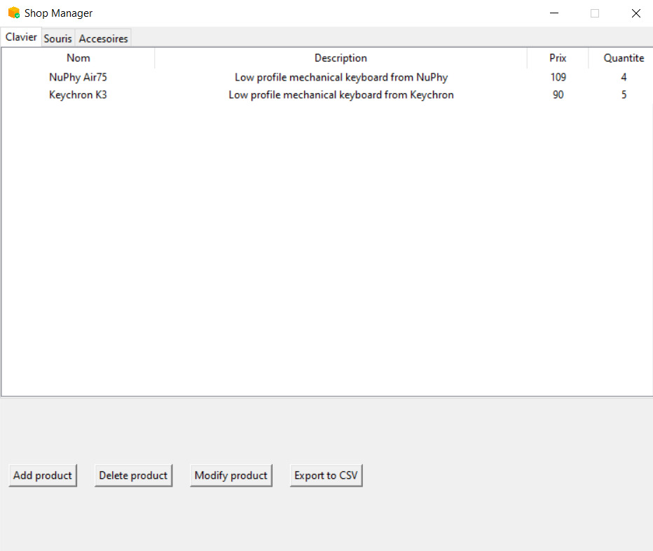
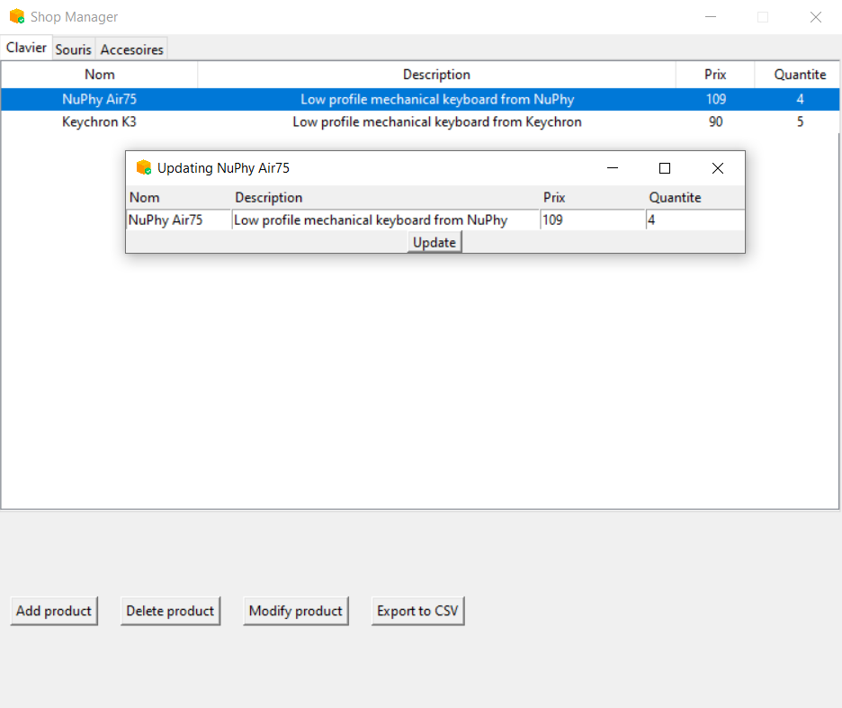

# <p align="center">**Shop manager**</p>


### __Requirements__


- Python 3.x
<br></br>


### Installation

- git clone
```
git clone https://github.com/pelayo-joel/gestion_de_stock.git
```

- [Python](https://www.python.org/downloads/)

<br></br>


## <p align="center">**Presentation**</p>
---
<div align="center">
</div>
<br></br>

<p align="center">A pretty simple shop manager app, you can; add, delete, modify products in the database via this Tkinter based interface. You can also exports the data of each categories in a CSV file stored in the ShopCSVs folder.</p>
<br></br>

### **Details**
- The structures here is pretty simple:
<br></br>

    - ``App.py`` file to run, the App class inherits the Tk class from tkinter.

    - ``Shop.py`` Sets up the database and contains a class that handles the different queries on the ``boutique`` database.

<br></br>
### **CREDITS** 

- [Pelayo Joel](https://github.com/pelayo-joel)

